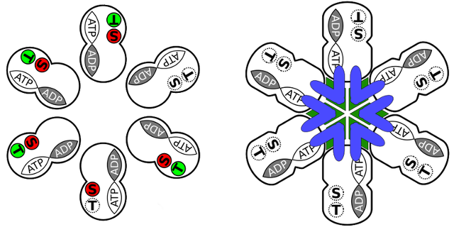
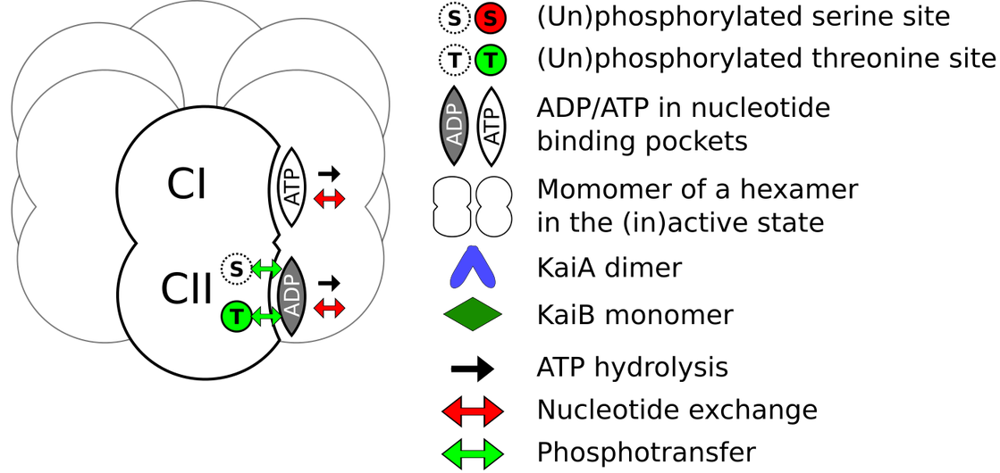

# KMC KaiC
Kinetic Monte-Carlo simulation of the in-vitro Kai Circadian clock



Figure 1: Two states of the KaiC hexamer - the main boulding block of the model.

MODEL CHANGE: FULLY REVERSIBLE VERSION OF THE MODEL

There are now version of the model:

1. The original published model as described in our article in [PLoS Computational Biology](https://doi.org/10.1371/journal.pcbi.1005415). This version of the model can be found in the branch named `main` (default).

2. A fully reversible model, now including the inverse reactions for ATP hydrolysis, as described below. This makes it possible to run the model at thermodynamic equilibrium. A possible set of parameters to run the system at equilibrium are given in the parameter file 'equilibrium.par'. This version of the model can be found in the  branch named `reversible`.
 
## Introduction
This code is a dedicated Kinetic Monte Carlo (KMC) algorithm 
which simulates a model of the post-translational Kai circadian clock.
The code allows you to simulate the Kai system at the level of individual
KaiC hexamers and monomers and explicitly tracks the turnover of every ATP 
nucleotide. This way, all the reaction rates in the simulation strictly obay
detailed balance.

The application of the code is described in the freely available preprint "A Thermodynamically consistent model of the post-translational Kai circadian clock":

https://doi.org/10.1371/journal.pcbi.1005415

The code is free for scientific use.  Please contact us if you plan to use this software for commercial purposes.  Do not further distribute without prior permission of the authors.  Please forward links to related publications so we can learn about your research.



Figure 2: State variables of the KaiC monomer available in the model.

## Requirements
The model is written in C++. Compilation of the code therefore requires a C++ compiler. No extra libraries are required.

## Installation
Either download and extract the zip-file of the repository, or clone it via

```git clone https://github.com/Paijmans/KMC_KaiC.git```

This wil put you in the ```main``` branch which is the original version of the model. To switch to the fully reversible version, please type

```git branch reversible```

To compile the code, in the terminal, located in the root directory of this repository, type

```make``` 

To make the program executable under linux, type

```chmod 744 KMCKaiC```

Finally, to run the model 

```./KMCKaiC [parameter_file]``` 

Assumes 'default.par' when no file is specified. Use equilibrium.par to run the system at thermodynamic equilibrium.

## Results
The program will output three files, named test.dat, Atest1.dat and Itest1.dat
containing time traces of inportant quantaties in the simulations, specified below.
In test.dat, the quantaties are averaged over all hexamers, 
in Atest.dat, the quantaties are averaged over all active hexamers 
and in Itest.dat, the quantaties are averaged over all inactive hexamers.

The ouput files will contain 23 columns, with the following quantaties

1. - Time
2. - Phosphorylation level
3. - Concentration of free KaiA
4. - Fraction of Hexamers which have KaiA bound to CI domain
5. - Fraction of Hexamers which have KaiA bound to CII domain
6. - Total KaiA fraction (should be constant).
7. - Mean number of ATP nucleotides bound to the CI domain, per hexamer.
8. - Mean number of ATP nucleotides bound to the CII domain, per hexamer.
9. - Mean number of phosphorylated threonine sites, per hexamer.
10. - Mean number of phosphorylated serine sites, per hexamer.
11. - Mean number of monomers in the unphosphorylated (U) state, per hexamer.
12. - Mean number of monomers in the threonine phosphorylated (T) state, per hexamer.
13. - Mean number of monomers in the doubly (D) state, per hexamer.
14. - Mean number of monomers in the serine phosphorylated (S) state, per hexamer.
15. - Total ATP nuceotides consumed on CI domain, per monomer.
16. - ATP consumption rate on CI domain, per monomer per 24 hours.
17. - Total ATP nuceotides consumed on CII domain, per monomer.
18. - ATP consumption rate on CII domain, per monomer per 24 hours.
19. - Mean rate for switching from active to inactive state.
20. - Mean on-rate of KaiA binding to CII domain.
21. - Mean ATP dissociation rate from the CI domain.
22. - Fraction of hexamers in the active state.
23. - Fraction of hexamers who have the maximal number of KaiB monomers bound on CI, 
     without having KaiA sequestered on CI.

## Reversible version of the model

### New reaction equations

We have added three reactions to the original model to make it fully reversible:

```1) CI.ATP + ADP --> CI.ADP + ATP (Parameters involved: kCI_ATP-off, KCI_ATP/ADP)```

The CI domain can now, just like the CII domain before, bind both ATP and ADP to the nucleotide binding pocket. However, the affinity for ATP is much larger than for ADP. This introduces a new parameter here: KCIATPADP, which is the relative affinity in the binding pockets of the CI domain for ATP versus ADP. 

KCIATPADP = k_off^ATP/k_off^ADP.

```2) CI.ADP + Pi --> CI.ATP (Parameters involved: Piconc, KCI_ATP/ADP, Khyd, kCIhyd)```

The hydrolysis pathways in the CI domain is now reversible. The binding of an inorganic phosphate in solution, Pi, to ADP bound in the CI binding pocket, is now possible. The inverse hydrolysis rate for the CI domain is calculated as:

kCIhydinv = Piconc * kCIhyd / (Khyd * KCIATPADP)

```3) CII.ADP + Pi --> CII.ATP (Parameters involved: Piconc, KCII_ATP/ADP, Khyd, kCIIhyd)```

Also the hydrolysis pathways in the CII domain is now reversible. Similar to the CI domanin, it is calculated as:

kCIIhydinv = Piconc * kCIIhyd / (Khyd * KCIIATPADP)

### New parameters
The new reactions introduce three new parameters to the model, which can be set in the parameter file:

1) Khyd: The Dissociation constant for ATP hydrolysis, named Khyd (ATP --> ADP + Pi), which I put to 1e5 micro molar in the simulation (There might be a better value. Mine is based on this publication: http://www.jbc.org/content/248/20/6966).

2) Piconc: The concentration of inorganic phosphate in solution, named Piconc ([Pi]). I could not find any value for the [Pi] in in-vitro experiments. I put it to 1e-3 micro molar, which has almost no effect on the simulation.

3) KCIATPADP: The relative nucleotide affinity of the CI domain defined as the ATP dissociation constant over the ADP dissociation constant, KCIATPADP = KCIATP/KCIADP.

## Reproduce manuscript figures
In the spirit of transparency and reproducibility, we include all code used to produce the results in the preprint referenced above, including code used to plot the figures.  To reproduce the results, one should run the scripts listed in the Figures subdirectory. How to run the 
scripts for each figure is explained in the README inside the Figures directory.

## Citation 
If you use this code in your work, please cite at least one of our two papers

- https://doi.org/10.1371/journal.pcbi.1005415
- https://doi.org/10.1016/j.bpj.2017.05.048

## License 
Copyright (c) 2017 Joris Paijmans

This program is free software: you can redistribute it and/or modify
it under the terms of the GNU General Public License as published by
the Free Software Foundation, either version 3 of the License, or (at
your option) any later version.

This program is distributed in the hope that it will be useful, but
WITHOUT ANY WARRANTY; without even the implied warranty of
MERCHANTABILITY or FITNESS FOR A PARTICULAR PURPOSE.  See the GNU
General Public License for more details.

You should have received a copy of the GNU General Public License
along with this program.  If not, see <http://www.gnu.org/licenses/>.
